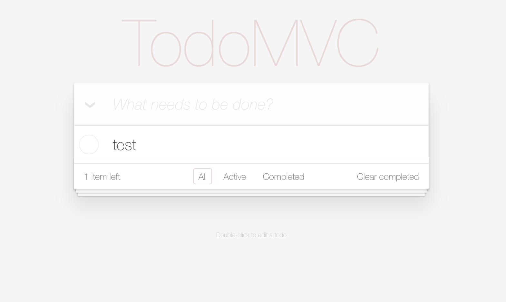

### Vue.js TodoList(TodoMVC) Example

> 樣板工具： vue-cli
> 套件：webpack

	

#### 實作

- 套用Vue.js TodoMVC Example的css
- 實現Vue.js TodoMVC Example的功能

##### 撰寫方式是比官網容易理解！

#### 檔案
- index.html
- src/main.js 
只有撰寫這兩個檔案!

#### 參考網站

[Vue.js to-do-list Example(1): 環境建置與指令簡介](http://souffle77-blog.logdown.com/posts/7810584-vuejs-to-do-list-example-vuejs-todomvc-example)

[Vue.js to-do-list Example(2):實作](http://souffle77-blog.logdown.com/posts/7810707-vuejs-to-do-list-example-2-implementation-vuejs-todomvc-example)

[TodoMVC Example in Vue.js website](https://cn.vuejs.org/v2/examples/todomvc.html)

[TodoMVC Example online](http://todomvc.com/examples/vue/)

[TodoMVC App Template](https://github.com/tastejs/todomvc-app-template)
